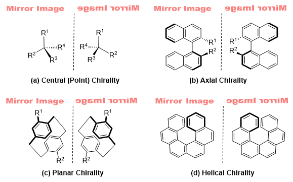

Note that the paper regarding this work has been submitted to the journal Molecular Informatics for review.
# Identifying Chirality in Line Drawings of Molecules Using Imbalanced Dataset Sampler for a Multilabel Classification Task
***Yong En Kok, Simon Woodward, Ender Özcan and Mercedes Torres Torres*** 

Chirality is the ability of molecules to exist as two forms of non-superimposable mirror images. If the two forms cannot be superimposed on each other through any combination of transaltaion, rotations and conformational (bond rotation) changes, the molecules are achiral. There are four common structural motifs that lead to the identification of molecular chirality, namely centre/point, axial, planar and helical chirality.



Chemists have used line drawings to represent chiral organic molecules for more than 150 years, but machine readable representations were only developed much later: SMILES (in 1980s) and InChI (from 2000). Nonetheless, these molecular languages are not sufficient to fully define the molecular chirality as they are presently unable to represent axial, planar and helical chirality. Additionally, the process of reconstructing the 2D line drawings into machine readable formats are susceptible to the loss of stereochemical information, thus limiting chiral recognition. 

Herein, we compared the pretrained EfficientNetV2 and ResNet50 networks that were fine-tuned for a binary task of chirality classification (achiral/chiral)and  a  multilabel  task  of  chirality  type  classification  (none/centre/axial/planar). 

To  address  the  label  combination imbalanced  problem  in  the  multilabel  task,  the  study proposed  a  new  data  sampling  method–Formulated Imbalanced Dataset Sampler (FIDS) to sample a formulated amount of minority label combinations on top of the training set. 

The research also demonstrated the potential of a deep learning network to make predictions that are align with human understanding of chirality through the study of heatmaps.

# Table of contents
1. [Installation](#Installation)
2. [CHIRAL Dataset](#CHIRAL-Dataset)
3. [Pretrained Models and the ChEMBL+ dataset](#Pretrained-Models-and-the-ChEMBL+-dataset)
4. [Usage](##Usage)
5. [Useful links](#Useful-links)

## Installation
```bash
pip install -r requirements.txt
```
Our code is mostly based on the scripts in [PyTorch Image Models](https://github.com/rwightman/pytorch-image-model) to train, test, infer and save the models. 

We modified the Pytorch Image Models at commit [6ae0ac6](https://github.com/rwightman/pytorch-image-models/tree/6ae0ac64208ad414778c4c1ec0a8746e500bb5da). The following are the modified files:
#### timm/data/
- parser_image_folder.py 
- parser_factory.py 
- dataset_factory.py 
- <span>dataset.py</span> 

#### timm/utils/
- <span>summary.py</span> 

To visualise the activation heatmaps, we applied [Pytorch Grad-Cam](https://github.com/jacobgil/pytorch-grad-cam) on our network.

## CHIRAL Dataset
The networks were trained and tested on our manually curated molecule dataset--CHIRAL.
There are two versions of the ChEMBL+ dataset that are available for download:
- [raw](https://zenodo.org/record/5759416/files/raw_CHIRAL.zip?download=1)
- [preprocessed](https://zenodo.org/record/5759416/files/bw_CHIRAL.zip?download=1) (removal of transparent background and converting them to grayscale images)

## Pretrained Models and the ChEMBL+ dataset
The EfficientNetV2 and ResNet50 networks were pretrained on the preprocessed ChEMBL+ dataset.
There are two versions of the ChEMBL+ dataset that are available for download:
- [raw](https://zenodo.org/record/5759416/files/raw_ChEMBL+.zip?download=1)
- [preprocessed](https://zenodo.org/record/5759416/files/bw_ChEMBL+.zip?download=1) (removal of transparent background and converting them to grayscale images)

The pretrained models can be downloaded from [here](https://zenodo.org/record/5759416/files/pretrained_models.zip?download=1).

## Usage 
We recommend that you download and save the dataset in the `dataset` folder. Do read about the data in the `readme_data.md` file stored in the `dataset` folder.
### Cross validation 
Binary model

`python trainBinary.py --config trainBinary.yaml`

Multilabel model

`python trainMulti.py  --config trainMulti.yaml`

### Infer for cross validation folds (for more detail performance evaluation)
Binary model

`python inferenceBinary.py --config inferenceBinary.yaml`

Multilabel model

`python inferenceMulti.py --config inferenceMulti.yaml`

## Useful links
- [dataset and pretrained models](https://zenodo.org/record/5759416)
- [demo website](https://chiral.cs.nott.ac.uk)
- [Zooniverse platform](https://www.zooniverse.org/projects/shuxiang/chiral-molecules) for molecule annotation
